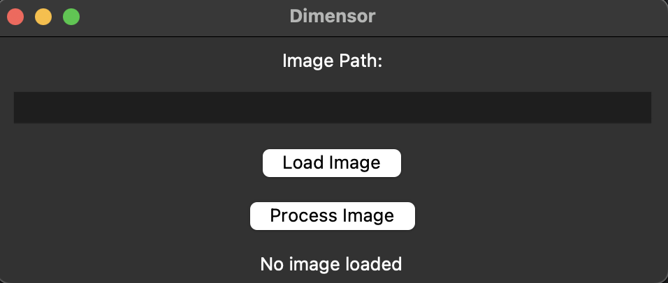

# Dimensor

Dimensor is a 
graphical user interface (GUI) application for estimating depth from images using the MiDaS model and visualizing the results as a 3D point cloud. The application is built with Tkinter for the GUI, Open3D for 3D visualization, and PyTorch for depth estimation.

## Features

- Load and display images using a file selection dialog.
- Process images to generate depth maps.
- Visualize depth maps as 3D point clouds.




## Requirements

- Python 3.7 or higher
- PyTorch
- torchvision
- Open3D
- OpenCV
- Pillow

## Setup Instructions

1. **Clone the Repository**

   ```bash
   git clone https://github.com/yourusername/dimensor.git
   cd dimensor
2. **Create and Activate a Virtual Environment**

   ```bash
   python -m venv venv
   source venv/bin/activate  # On Windows use `venv\Scripts\activate`
3. **Install Required Packages**

4. **Download MiDaS Model**
   The MiDaS model will be downloaded automatically when you run the application. Ensure you have an internet connection.

## Usage
1. **Run the Application**
    ```bash
   python app.py
2. **Use the GUI**
    
    - **Browse**: Click the "Browse" button to open a file dialog and select an image file. The file path will be automatically filled in the entry field.
    - **Load Image**: Click the "Load Image" button to display the image in the GUI.
    - **Process Image**: Click the "Process Image" button to generate and visualize the 3D point cloud.
## File Structure
- **app.py**: Main application file with Tkinter GUI and depth estimation logic.
- **depth_estimation.py**: Module containing image processing and depth estimation functions.
- **requirements.txt**: List of required Python packages.
## Contributing
Feel free to submit issues or pull requests if you have suggestions or improvements.

## License
This project is licensed under the MIT License - see the [LICENSE](./LICENSE) file for details.